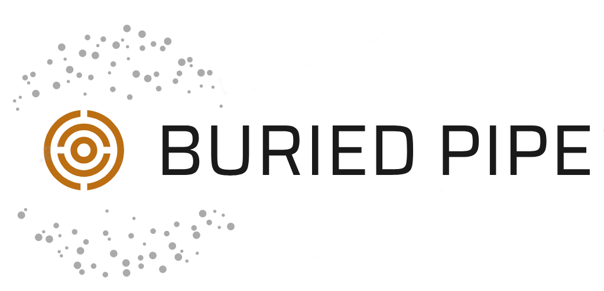

# What is BuriedPipe

BuriedPipe is a 2D Discrete Element Method (DEM) simulation application, for disks in a periodic cell. It focuses on a pipe that is placed within a granular packing made of disks.

